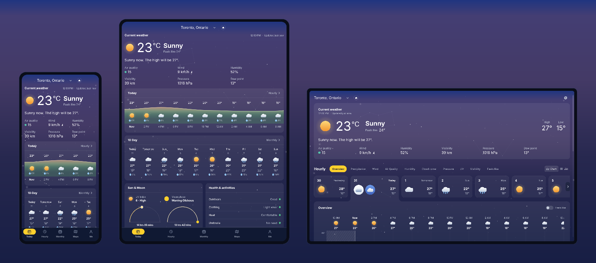
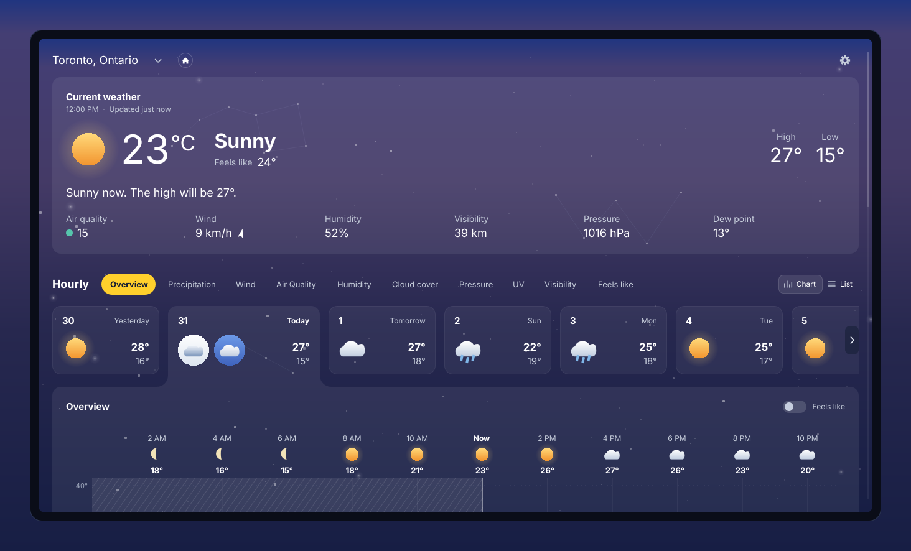
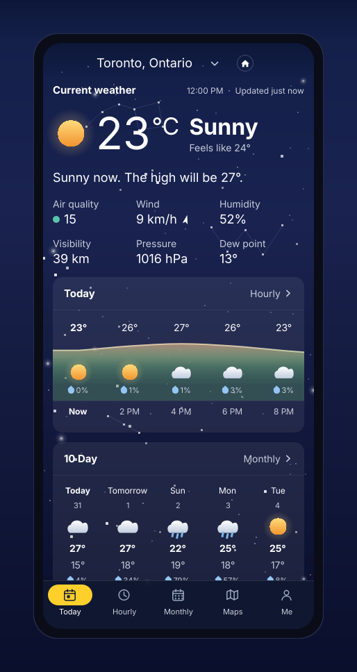
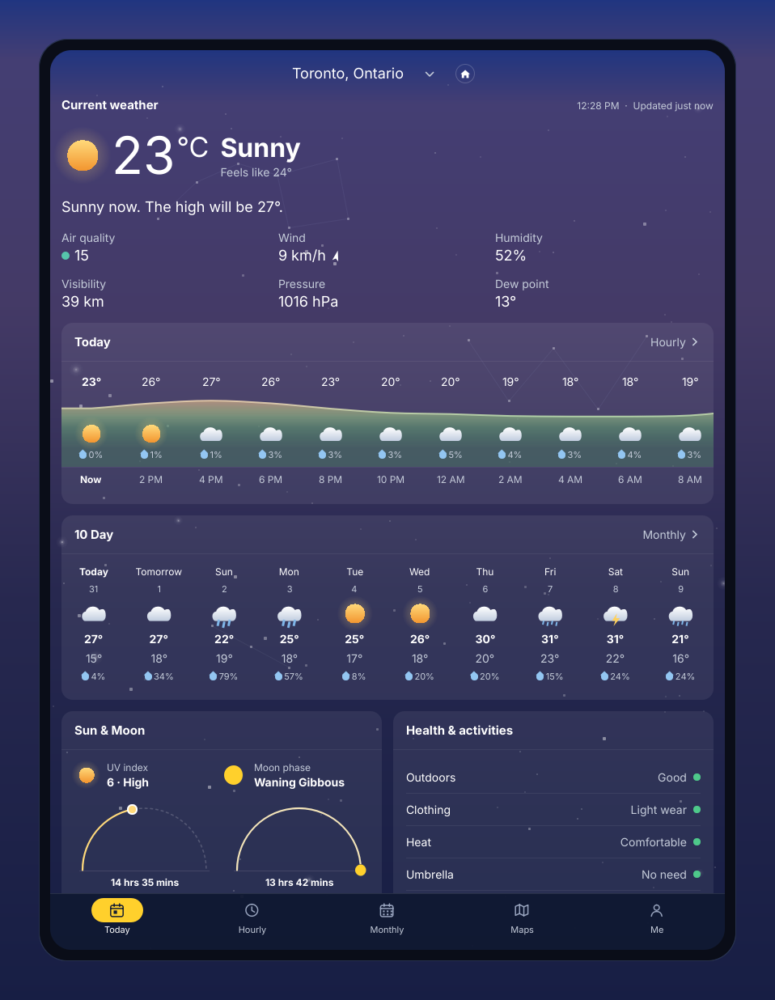
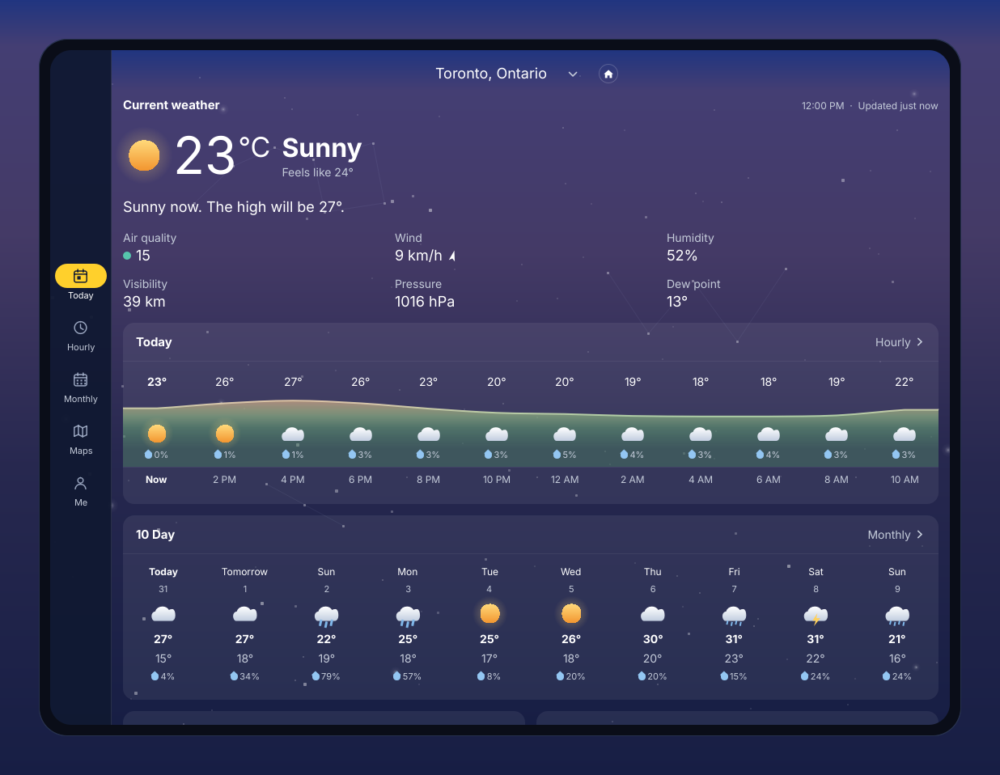
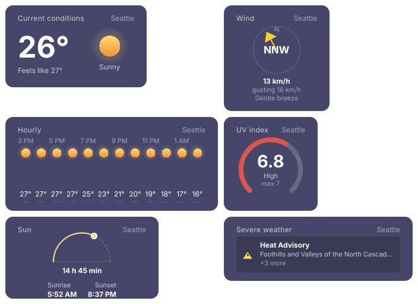

<!-- SPDX-FileCopyrightText: 2026 Clima contributors -->
<!-- SPDX-License-Identifier: CC-BY-SA-4.0 -->

# Clima

> A native, ad-free, open-source weather app for Linux and Windows. Two weeks of
> forecast as charts you can read, and official severe-weather warnings on every
> screen where they matter.



**Status: early. Version 0.1.0, and the version number is honest** — this
installs, runs and shows you real weather, and several things the plan calls for
are not built yet. [What is missing](docs/known-gaps.md) is written down rather
than left to be discovered.

Every image in this README is rendered from the running application by
`scripts/shots.sh`, and CI re-renders and diffs them. They cannot drift from
what the app actually draws.

## What it does today

- **Hourly and ten-day forecasts** — temperature, precipitation, wind, humidity,
  pressure, visibility, UV and air quality, as charts rather than a grid of
  numbers.
- **Severe weather warnings**, live, from Environment and Climate Change Canada
  and the United States National Weather Service. No API key, no account, no
  server of ours in the middle.
- **Detail cards** for sunrise and sunset, the moon phase, and each measurement
  in turn.
- **A dark and a light theme**, following the desktop's own setting through the
  XDG portal.
- **Phone, tablet and desktop layouts** — one product, three arrangements,
  chosen by the width of the window.
- **Ten desktop widgets**, drawn from the same components as the app, pinned
  under your windows on GNOME by a shell extension that draws no weather itself,
  and on KDE, Sway, Hyprland and every other wlroots compositor by the tiles
  asking for it directly. One process fetches; every tile and the top-bar
  indicator read from it over the session bus, so a desktop full of widgets is
  one client of the forecast service and not eight.
- **Offline-first.** It renders from its cache and reconciles with the network,
  so a service being down is never an empty screen.
- **No ads, no news feed, no telemetry, no account, no API key.**

## What it does not do yet

Stated here rather than at the bottom, because a README that lists a roadmap as
if it were a feature list is the thing this project is trying not to be.

- **No radar or map.** The Maps tab renders a deliberate placeholder that says
  so. This is the single largest gap against the goal in `docs/01-landscape.md`.
- **No model comparison.** Showing ECMWF against GFS against ICON with ensemble
  ranges is the differentiator this project exists for, and it is not built.
- **No macOS build** — notarisation needs an Apple Developer ID.
- **The Windows build is unsigned**, so SmartScreen warns on first run.
- **Android is plumbed and has never run on a device.** The gate is delivering
  an alert to a sleeping phone, which Qt has no answer for.
- **The widgets have never been pinned on a KDE session.** They pin themselves
  on GNOME, which was measured by hand, and on wlroots, which is measured in CI
  against a headless compositor. KWin implements the same protocol and nobody
  has run it there.

All six, with what would close them: [`docs/known-gaps.md`](docs/known-gaps.md).

## Install

### Linux

**Flatpak** is the primary channel. It brings its own Qt, so it works on any
distribution — including Ubuntu 24.04, which ships Qt 6.4 and cannot run the
`.deb`.

```sh
flatpak install --user ./clima-0.1.0-x86_64.flatpak
flatpak run io.github.JowiAoun.Clima
```

**Debian 13 / Ubuntu 26.04 or newer**, using the distribution's own Qt:

```sh
sudo apt install ./clima_0.1.0_amd64.deb
```

It declares `libqt6core6t64 (>= 6.8.2)` and apt will refuse to install it on
anything older. That is the intended behaviour — a package that installed and
then would not start is worse than one that says why.

### Windows

Download the `.msi` and run it. It installs per-user, so it needs no
administrator rights.

**Windows will show an "unknown publisher" warning.** The build is not
code-signed, because signing requires a certificate this project does not have.
The [mitigations](docs/known-gaps.md) are listed in the order they should be
attempted; in the meantime every release carries `SHA256SUMS` and GitHub build
provenance:

```sh
gh attestation verify clima-0.1.0-windows-x64.msi --repo JowiAoun/clima
```

That proves the file came out of this repository's release workflow at a named
commit. It is weaker than a signature in one way — Windows does not check it —
and stronger in another, since it names the source revision.

## What it looks like

| | |
|---|---|
| **Desktop** — one scrolling column, the chart card open on Overview <br>  | **Phone** — five destinations under a nav bar <br>  |
| **Tablet** — two content columns, bottom bar <br>  | **Tablet, turned** — the nav becomes a left rail <br>  |

**Desktop widgets** — six of the ten. On GNOME a shell extension launches
Clima's own Qt process and pins its window below everything else; it draws none
of this itself, because GNOME Shell cannot host a QML surface. On KDE and every
wlroots compositor the same binary asks for a desktop-layer surface and there is
no extension at all. [`docs/widgets.md`](docs/widgets.md) has both mechanisms
and the measurements.



The tablet is not a third layout. It is the phone's shell with two questions
answered differently — how many content columns the width buys, and whether the
navigation is a bar or a rail. See
[`docs/10-design-system.md`](docs/10-design-system.md) §10.12.

## Build from source

Everything goes through a Nix devshell, which pins Qt, the compiler, FreeType
and fontconfig by store hash — that is what makes the golden images reproducible
on a machine that is not this one.

```sh
nix develop --command cmake --preset dev
nix develop --command cmake --build build/dev
scripts/dev-run.sh                             # builds if needed, finds Qt itself
```

`scripts/dev-run.sh` is the one entry point that works from a plain shell.
Running `build/dev/app/clima` directly outside `nix develop` exits silently,
because Qt is only in the Nix store and the binary cannot find its QML imports.

Try the layouts and the themes:

```sh
scripts/dev-run.sh --viewport mobile
scripts/dev-run.sh --viewport tablet-landscape --scheme light
scripts/dev-run.sh --place "Halifax"           # live ECCC alerts
scripts/dev-run.sh --fixture seattle           # four NWS alerts, offline
```

Without a Nix devshell, any Qt 6.8 or newer works —
[`BUILDING.md`](BUILDING.md) has the distribution package lists and the
CMake options.

## Testing

```sh
nix develop --command ctest --test-dir build/dev --output-on-failure
```

25 test binaries; 265 QML assertions; 46 golden images compared byte for byte.
The component gallery is a second binary and the fastest way to look at
anything in isolation:

```sh
CLIMA_BINARY=build/dev/gallery/clima-gallery scripts/dev-run.sh
```

It has a touch-target overlay that draws every tap area a layout leaves under
44 px, which is how nine undersized controls were found — including a 14×14
disclosure chevron on every phone screen.

## Stack

C++20 engine (`libclima`, GUI-free and enforced by a CMake assertion) under a
**Qt 6.8+ / QML** interface, with a hand-written scene-graph chart kit.
Open-Meteo is the primary forecast provider with MET Norway as a fallback;
alerts are region-routed to ECCC and the NWS. Reverse geocoding is offline, from
a 412 KiB bundled GeoNames index, so turning a coordinate into "Toronto,
Ontario" never leaves the machine.

There is no server. There never will be — every request goes from your machine
to a public weather service, and nothing goes anywhere else.

## Data and attribution

Weather from [Open-Meteo](https://open-meteo.com/) (CC-BY 4.0), which aggregates
ECMWF, NOAA, DWD, Météo-France, the UK Met Office and fourteen more national
services; [MET Norway](https://api.met.no/) as fallback; alerts from
[ECCC](https://api.weather.gc.ca/) (Open Government Licence – Canada 2.0) and
the [US National Weather Service](https://api.weather.gov/) (public domain);
place names from [GeoNames](https://www.geonames.org/) (CC-BY 4.0).

Every source is credited at runtime under **About → Data sources**, generated
from the provider registry rather than maintained by hand. The full record is in
[`docs/02-data-sources.md`](docs/02-data-sources.md) §2.9.

## Licence

- `libclima` — **MPL-2.0**, so the engine stays reusable outside a GPL program
- the application — **GPL-3.0-or-later**
- authored assets and documentation — **CC-BY-SA-4.0**
- bundled Inter — **OFL-1.1**; bundled GeoNames data — **CC-BY 4.0**

The repository is [REUSE 3.3](https://reuse.software/) compliant: every file
carries an SPDX header, and `reuse lint` gates every commit. Every release
carries an SBOM and a third-party licence bundle generated from that same
metadata, plus a written offer for Qt's corresponding source.

Contributions are by **DCO sign-off**. There is no CLA.

## Contributing

Start with [`CONTRIBUTING.md`](CONTRIBUTING.md). The short version: conventional
commits, `git commit -s`, and if a change moves a golden image or a README
image, the pull request has to say why the pixels moved.

The planning documents in [`docs/`](docs/README.md) are a frozen baseline,
amended in place with dated corrections when the code contradicts them —
`docs/07-packaging.md` §7.6 is a good example of what that looks like.
