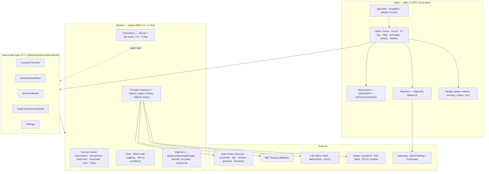

<!-- SPDX-FileCopyrightText: 2026 Jowi Aoun -->
<!-- SPDX-License-Identifier: CC-BY-SA-4.0 -->

# 04 — Architecture

## 4.1 Design principles

1. **Offline-first.** The UI renders from cache, then reconciles with the network. The app
   must never show an empty screen because an API is down — the documented failure mode of
   the current best Linux weather app.
2. **Providers are pluggable and region-routed.** No provider name appears in UI code.
3. **The engine has no GUI dependency.** `libclima` links Qt Core/Network only, so it can be
   reused by a CLI, a Plasma applet, a GNOME extension, or a widget.
4. **Uncertainty is a first-class data type.** Every forecast value can carry an ensemble
   spread and a per-model set. The UI is designed around that from the start rather than
   retrofitted.
5. **Zero telemetry, zero accounts, zero keys.** Privacy is a feature we advertise.
6. **Render on the GPU, compute off the UI thread.** Parsing, unit conversion and
   aggregation happen on worker threads; the scene graph never blocks.

## 4.2 Layers



## 4.3 Repository layout

```
clima/
├── CMakeLists.txt
├── LICENSES/                     # SPDX licence texts (REUSE-compliant)
├── docs/                         # this plan
├── libclima/                     # MPL-2.0 engine, no Qt GUI
│   ├── domain/                   # value types, units, WMO codes
│   ├── providers/
│   │   ├── iforecastprovider.h   # + iairquality, ialert, iradar, igeocode
│   │   ├── openmeteo/
│   │   ├── metno/
│   │   ├── cap/                  # shared CAP 1.2 parser
│   │   ├── nws/  meteoalarm/  eccc/
│   │   └── radar/                # librewxr, iem_wms, eccc_geomet
│   ├── net/                      # http client, backoff, UA, request coalescing
│   ├── cache/                    # sqlite store, tile cache, migrations
│   └── registry/                 # region routing + fallback chains
├── app/                          # GPL-3.0-or-later
│   ├── main.cpp
│   ├── viewmodels/
│   ├── charts/                   # ClimaCharts scene-graph items
│   ├── qml/
│   │   ├── views/  components/  theme/
│   ├── fonts/                    # Inter, OFL-1.1 — the UI face, bundled
│   └── assets/                   # Meteocons → generated QML
├── gallery/                      # `clima-gallery` — every component on one screen, ships nowhere
├── cli/                          # `clima-cli` — scriptable forecast output
├── platform/
│   ├── linux/                    # desktop file, appstream, portals, tray, Plasma applet
│   ├── windows/                  # manifest, MSIX, jump list
│   └── macos/                    # Info.plist, entitlements, notarisation
├── packaging/                    # flatpak, appimage, aur, msix, dmg, winget
└── tests/                        # unit, golden-file provider parsing, QML tests
```

## 4.4 Provider interfaces (sketch)

<!-- The sketch below is libclima source, not documentation prose, so it carries -->
<!-- the engine's licence rather than this document's. REUSE snippet tags scope   -->
<!-- that to the fence: the file stays CC-BY-SA-4.0, the code inside is MPL-2.0.  -->
<!-- SPDX-SnippetBegin -->
<!-- SPDX-SnippetCopyrightText: 2026 Jowi Aoun -->
<!-- SPDX-License-Identifier: MPL-2.0 -->

```cpp
// libclima/providers/iforecastprovider.h
namespace clima {

struct ForecastRequest {
    Coordinate  coord;
    int         days        = 10;
    Resolution  resolution  = Resolution::Hourly;   // Hourly | Minutely15
    QStringList models;                             // empty = provider default/blend
    bool        wantEnsemble = false;
};

class IForecastProvider {
public:
    virtual ~IForecastProvider() = default;

    virtual QString      id()          const = 0;   // "open-meteo"
    virtual QString      displayName() const = 0;
    virtual Attribution  attribution() const = 0;   // shown in About → Data sources
    virtual Capabilities capabilities() const = 0;   // bitflags: ensemble, minutely15, …
    virtual bool         covers(Coordinate) const = 0;

    // Never returns a partial success silently: either a Forecast or a typed Error.
    virtual QFuture<Result<Forecast>> fetch(const ForecastRequest&) = 0;
};

} // namespace clima
```

<!-- SPDX-SnippetEnd -->

`ProviderRegistry` resolves a request to an ordered chain:

```
resolve(coord, kind) -> [primary, fallback…]
  forecast : open-meteo → met.no
  alerts   : if US → nws ; else if EU/UK/IL → meteoalarm ; else if CA → eccc ; else ∅
  radar    : if US → iem ; else if CA → eccc ; else librewxr ; else ∅ (map hides layer)
```

A provider that returns `∅` must make the UI *hide* the feature, not show a broken one.

## 4.5 Caching and refresh policy

| Data | TTL | Revalidation | Stale-while-revalidate |
|---|---|---|---|
| Current conditions | 10 min | ETag / `If-Modified-Since` | ✅ show stale with a subtle "updated 25 min ago" |
| Hourly / daily forecast | 30 min | ETag | ✅ |
| 15-minute nowcast | 5 min | — | ✅ |
| Ensemble / model comparison | 60 min | — | ✅ |
| Air quality | 60 min (CAMS updates 12-hourly) | — | ✅ |
| Alerts | 3 min foreground, 10 idle, **stopped when hidden**, 15 metered | CAP `sent`/`expires` | ⚠️ never show an **ended** alert |
| Radar frames | Frame lifetime (5 min) | Timeline manifest | ✅ |
| Basemap tiles | 30 days | — | ✅ |
| Historical archive / ERA5 | Immutable, cache forever | — | n/a |
| Geocoding results | 7 days, keyed by query+lang | — | ✅ |

Rules: never more than one in-flight request per (provider, endpoint, location) — coalesce
duplicates; exponential backoff with jitter on 5xx/429; **hard stop** on 403 from MET
Norway (that means our User-Agent policy is broken, and retrying makes it worse); no
background polling while the window is hidden unless the user enabled alert notifications.

Storage: SQLite via Qt Sql at `QStandardPaths::AppDataLocation`, schema-versioned with
forward-only migrations. Tiles in a separate size-capped LRU directory (default 200 MB).

**What alert polling actually costs.** The estimate this table was written against assumed
both services revalidate. Measured on 2026-08-05, only one does: `api.weather.gov` sends an
`ETag` and most of its polls come back 304, while `api.weather.gc.ca` sends **no validator at
all** — no `ETag`, no `Last-Modified`, no `Cache-Control`, only `Vary: Accept-Encoding` — so
every Canadian poll is a full transfer of about 10 kB. A day of uninterrupted foreground
polling in Canada is therefore nearer 5 MB than the 264 kB originally budgeted.

The line that brings that down is "stopped when hidden", which is why it is in the table
rather than in a comment. `app/viewmodels/alertsdata.h` owns the schedule; the measurements
are in `tests/fixtures/alerts/README.md`.

## 4.6 ClimaCharts — the chart kit

Each chart is a `QQuickItem` subclass implementing `updatePaintNode()`, building
`QSGGeometryNode`s with the geometry held as a member of the node subclass (no
`OwnsGeometry`, no per-frame allocation). All scene-graph interaction happens in
`updatePaintNode()` on the render thread; data arrives via a thread-safe snapshot swapped
under `updatePolish()`.

| Chart | Visual | Where |
|---|---|---|
| `TemperatureBand` | High/low ribbon with day/night shading and "feels like" ghost line | Home, 10-Day |
| `PrecipBars` | Amount bars + probability overlay, snow/rain/shower colour split | Home, Hourly |
| `NowcastRibbon` | 15-min precipitation intensity for the next 2 h | Home (region-gated) |
| `EnsembleFan` | Percentile fan (p10/p25/p50/p75/p90) + optional spaghetti members | **Models view** |
| `ModelDivergence` | Small multiples, one line per model, with a disagreement heat strip | **Models view** |
| `WindRose` / `WindBarbs` | Direction + gust distribution | Hourly, detail |
| `SunArc` | Sunrise/sunset/solar-noon arc, civil twilight, moon phase | Home |
| `AqiGauge` | Dual-scale (US/EU) radial with pollutant breakdown bars | Air Quality |
| `HistoryDecades` | Same calendar day across 30 years, with this year highlighted | History (MSN parity) |
| `AccuracyScoreboard` | Past forecast vs. observed, per model | **Models view** (differentiator) |

Shared infrastructure: `AxisModel` (time and value scales, tick generation, DST-aware),
`ChartTheme` (tokens from the design system), `Crosshair` (synchronised scrubbing across
stacked charts — MSN does this and it feels great), and a `ChartAccessibility` layer that
exposes each series as a screen-reader table.

## 4.7 Map architecture

- `MapLibre Native Qt` renders vector basemap + raster radar overlay into a Qt Quick FBO.
- Layer stack: basemap (desaturated custom style) → radar raster → alert polygons (from
  CAP `<polygon>`/`<geocode>`) → temperature/wind field overlay (post-1.0) → labels on top.
- Radar timeline: a scrubber over the provider's frame manifest, prefetching ±2 frames,
  with playback at a fixed 8 fps regardless of frame spacing.
- Style JSON is shipped as a resource with light/dark variants; **no runtime style
  download**, so the map works offline with cached tiles.
- Alert polygons are clickable → opens the CAP detail sheet.

## 4.8 Threading model

| Thread | Work |
|---|---|
| GUI thread | QML, view-models, signal plumbing only. No parsing, no file I/O. |
| Render thread (Qt-owned) | Scene graph, `updatePaintNode()`, MapLibre GL |
| Network/parse pool (`QThreadPool`) | JSON/CAP/XML parsing, unit conversion, aggregation, ensemble percentile computation |
| Cache thread | SQLite writes, tile eviction |

`QFuture`/`QPromise` across boundaries; domain value types are immutable and copy-cheap so
snapshots cross threads without locking.

## 4.9 Desktop integration (the part that earns "especially on Linux")

| Integration | Linux | Windows | macOS |
|---|---|---|---|
| Notifications | XDG Desktop Portal / `org.freedesktop.Notifications` | Toast + Action Center | Notification Center |
| Autostart / background | `xdg-desktop-portal` Background + Autostart | Startup task | Login item |
| Tray / status item | StatusNotifierItem (KDE/appindicator) | Tray icon with live temp | Menu-bar item with temp |
| Widget / applet | **Plasma 6 applet** + **GNOME Shell extension** reusing `libclima` | Windows Widgets (post-1.0) | Today widget (post-1.0) |
| Global shortcut | Portal GlobalShortcuts | — | — |
| Search integration | KRunner plugin, GNOME Search Provider | — | Spotlight (post-1.0) |
| Location | `Qt Positioning` → GeoClue2 | Windows Location | CoreLocation |
| Theming | Follows Plasma/GNOME accent + dark mode, Wayland-native, CSD | System accent, Mica | Vibrancy, accent |

The Plasma applet and GNOME extension are exactly why `libclima` is MPL-2.0 and GUI-free.

## 4.10 Accessibility, i18n, units

- Every chart exposes an accessible data table; nothing is colour-only (weather severity
  gets shape + label, colour-blind-safe palettes, tested for deuteranopia/protanopia).
- **No target smaller than `Theme.metric.hitMin` (44 px) in either direction.** It is a
  floor on the target, not on the mark: `TouchTarget.qml` grows an invisible area around a
  control that should stay small, and a control whose size *is* its affordance grows
  instead. Two audits enforce it — `tests/qml/tst_hittargets.qml` walks every screen the
  mobile shell reaches and fails on anything under the floor, and the gallery's **Touch
  targets** overlay draws them for review. Neither replaces the other: the test says a
  screen passes, the picture says what passing looks like.
- Full keyboard navigation including chart scrubbing and radar timeline.
- Respect `prefers-reduced-motion` equivalents; all animation is disable-able.
- Qt Linguist `.ts` catalogues; translation via Weblate. WMO code → localised condition
  strings live in `libclima` so the CLI and applets share them.
- Units are per-quantity, not a global metric/imperial switch (people want °C with mph, or
  inHg with mm) — a lesson from every weather-app review comment section.
- The clock format IS global — `Settings.clockFormat`, 12h or 24h — and that is not a
  contradiction of the line above. A unit is a property of a quantity and there are five
  of them; a clock is a property of the reader. `app/viewmodels/timeformat.h` is the one
  place that reads the key, and it reaches the app and the widget host both, because
  before it existed this program printed "3 PM" on a chart and "23:00" in the banner
  underneath it.

## 4.11 Testing strategy

| Layer | Approach |
|---|---|
| Domain / units / WMO mapping | Plain unit tests, exhaustive on the 0–99 code table |
| Provider parsing | **Golden-file tests** against recorded API responses committed to `tests/fixtures/` — no network in CI |
| Provider contract | A shared conformance suite every `IForecastProvider` must pass |
| Registry / fallback | Fault injection: provider down, 429, 403, malformed JSON, partial data |
| Cache | Migration tests, TTL/expiry, stale-while-revalidate behaviour |
| Charts | Golden-image comparison via `QQuickWindow::grabWindow()` with a tolerance |
| QML | `qmltestrunner` for interaction and state |
| Performance | Startup and frame-time budgets asserted in CI on Linux (§3.4) |
| Licence hygiene | `reuse lint` in CI; generated `licences/` bundle verified present |
