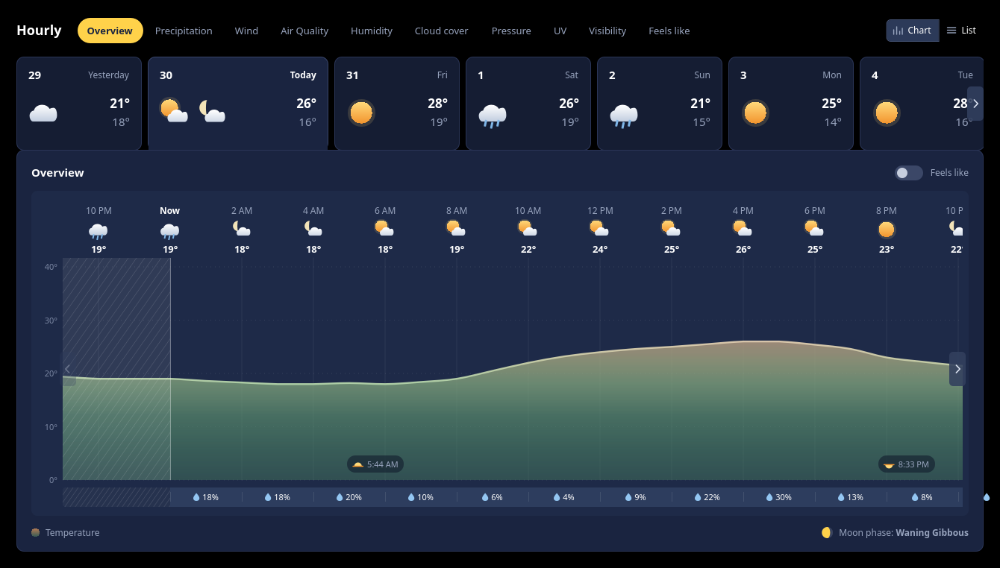
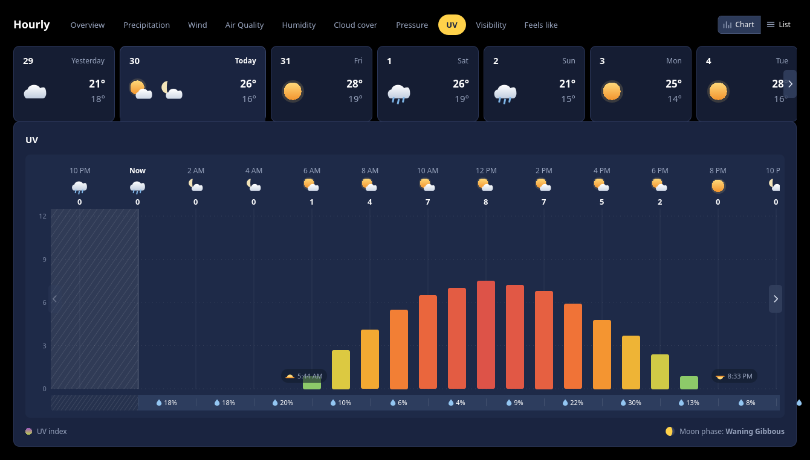

<!-- SPDX-License-Identifier: CC-BY-SA-4.0 -->

# Prototype — Hourly screen

A Qt Quick rebuild of MSN Weather's **Hourly** screen: the metric tab bar, the day
strip, and the chart card that is the most-liked thing in that app.



Every metric tab is live, and the chart re-scales, re-colours and changes series type
to match:



## Run it

No build step. It is pure QML, executed by Qt 6's `qml` runtime.

```sh
./run.sh                              # open the window
./run.sh --grab shot.png              # render one frame headless and exit
./run.sh --grab shot.png --metric uv  # …with a given tab selected
```

`run.sh` finds a `qml` binary on `PATH`, or falls back to the newest one in the Nix
store, and wires up the environment those builds need. Overrides:

```sh
CLIMA_QML=/path/to/qml ./run.sh     # a specific Qt
QT_QPA_PLATFORM=xcb ./run.sh        # force X11 if Wayland misbehaves
```

Verified on Qt **6.11.1**, offscreen (software) and Wayland (GPU). Requires `QtQuick`
and `QtQuick.Shapes` only — no Qt Charts, no Qt Graphs, no Qt Lottie, so nothing here
pulls in a GPL-only module (see `docs/03-tech-stack.md` §3.1).

## Structure

| File | Role |
|---|---|
| `Main.qml` | Window; assembles tab bar → day strip → chart |
| `MetricTabBar.qml` | Section title, metric pills, chart/list switch |
| `DayStrip.qml` | Day cards; the selected one widens and merges into the chart below |
| `HourlyOverview.qml` | The chart card: axis, grid, header band, past treatment, crosshair |
| `SeriesArea.qml` | Gradient-filled curve with an optional dashed overlay line |
| `SeriesBars.qml` | One bar per hour, coloured by its own value |
| `metrics.js` | **The metric registry — the tab bar and the chart are both driven from it** |
| `mockdata.js` | Stand-in for the Open-Meteo provider |
| `theme.js` | Design tokens and the colour ramps |
| `chartmath.js` | Path generation, ramp sampling, moon phase |
| `WeatherGlyph` · `SunEventGlyph` · `MoonGlyph` · `DropletGlyph` · `HatchPattern` · `PagerButton` · `FeelsLikeToggle` | Small procedural pieces |

## What it does

**Chart**

| | |
|---|---|
| **Metric-driven** | Ten tabs, one implementation. A metric declares its range, colour ramp, unit and whether it draws as an area or as bars; the axis, grid, header band, scrolling, crosshair and past treatment are shared. Adding a metric is a data change in `metrics.js`, not a code change |
| **Area series** | Catmull-Rom spline with control-point clamping, so it is monotone between samples and never invents a dip the data does not contain |
| **Bar series** | For quantities that are sums or banded indices — rain, UV, AQI. Drawing 0.4 mm then 0 mm as a smooth curve would be a lie, and published bands (WHO UV, European AQI) are categorical, so each bar takes the flat colour of its own band |
| **Gradient fill** | Vertical gradient over the *value* axis, so colour encodes the absolute value. Ramps are keyed by normalised axis position rather than by unit, which is what lets one implementation serve °C, %, km/h and hPa |
| **Gradient curve** | `ShapePath` can gradient-*fill* but not gradient-*stroke*, so the line is a thin closed ribbon around the curve, filled with the same ramp |
| **Auto-scaling axis** | Opt-in per metric. Precipitation uses it: a fixed 0–4 mm axis renders a drizzle as a flat line, which reads as "no data" rather than "a little rain" |
| **Overlay series** | Wind draws gusts as a dashed line over the speed area |
| **The past** | Veiled and hatched *over* the series. Observed hours are real data so they stay visible, but they are visibly not forecast |
| **Feels like** | On Overview, toggling *morphs* the curve — the path is regenerated from interpolated points each frame, so it is a genuine tween rather than a crossfade |

**Around it**

- Day cards with per-day icons and highs/lows; the selected card widens to fit a second
  (night) icon and squares off its bottom edge to merge with the chart card below.
- Metric pills generated from the registry, with a chart/list view switch.
- Horizontal flick + drag and animated pager buttons on both the day strip and the chart,
  disabling at the bounds.
- Hover crosshair with a time/value readout.
- `--grab` renders one frame headless — for design review now, golden-image tests later.

## Data

`mockdata.js` stands in for the Open-Meteo provider, and its shape mirrors what
`libclima`'s forecast provider will return: parallel per-hour arrays plus derived
helpers, with no formatting decisions baked in.

Temperature, precipitation probability and cloud cover are hand-tuned so the labelled
hours match the MSN reference exactly (19, 19, 18, 18, 18, 19, 22, 24, 25, 26, 25, 23 and
18, 18, 20, 10, 6, 4, 9, 22, 30, 13). The other series are *derived* from those rather
than hand-typed, so they stay internally coherent — humidity tracks temperature
inversely, visibility drops in rain, air quality peaks at rush hour and clears in wind.
All of it is deterministic, with no `Math.random`, so golden-image tests stay stable.

## Deliberately not done yet

- **Real data.** No network layer; that is milestone M1.
- **The list view.** The Chart/List switch changes state but there is no list yet.
- **Selecting a different day** re-renders nothing — there is one day of hourly data.
- **A secondary axis.** Precipitation *probability* belongs on the precipitation tab as a
  percentage line, but that needs a second axis; for now probability lives in the strip
  under the chart, where it shares the same time axis.
- **Shipped icons.** Icons are drawn procedurally to keep this a single `qml` invocation.
  Production uses Meteocons (MIT) converted with `svgtoqml`, which ships with
  qtdeclarative and is present in this Qt, so the pipeline is confirmed available.
- **C++ scene-graph rendering.** Paths are generated in JS and handed to `PathSvg`,
  because QML's declarative path elements cannot be produced by a `Repeater`. Decision D3
  in `docs/03-tech-stack.md` moves the curve to a `QQuickItem` writing `QSGGeometryNode`s
  once there is a perf reason; `chartmath.js` is the maths that will port.
- **Accessibility.** No screen-reader data table, no keyboard scrubbing. Both are M2
  requirements and neither is retrofittable for free — do not let this prototype set the
  precedent.

## Notes for whoever picks this up

- `font.pixelSize` is an **int** in Qt. Assigning `12.5` fails object creation, and Qt
  reports it only as `Type X unavailable` from the *parent* file.
- `Item` declares some obvious names — `top` among them — as FINAL. A
  `readonly property real top` in a delegate fails with `Cannot override FINAL property`.
  Prefix delegate locals (`barTop`, `barValue`) to stay clear of them.
- Qt suppresses QML error output entirely when it decides stderr has no console.
  `QT_FORCE_STDERR_LOGGING=1` (which `run.sh` sets) is the difference between a useful
  error and the useless `qml: Did not load any objects, exiting.`
- On a GNOME session Qt loads its **gtk3** platform theme, which initialises the host GTK
  in-process. A Nix-store Qt links its own GTK against a different module path, so
  GNOME's `canberra-gtk-module` cannot be found and GTK prints a warning on every launch.
  `run.sh` sets `QT_QPA_PLATFORMTHEME=generic` **only for Nix-store Qt** — a distro or
  Flatpak Qt has a consistent GTK stack and keeps the integration.
- `Shape.CurveRenderer` gives visibly better antialiasing on the GPU and falls back
  cleanly under the software backend, so it is safe to leave on.
