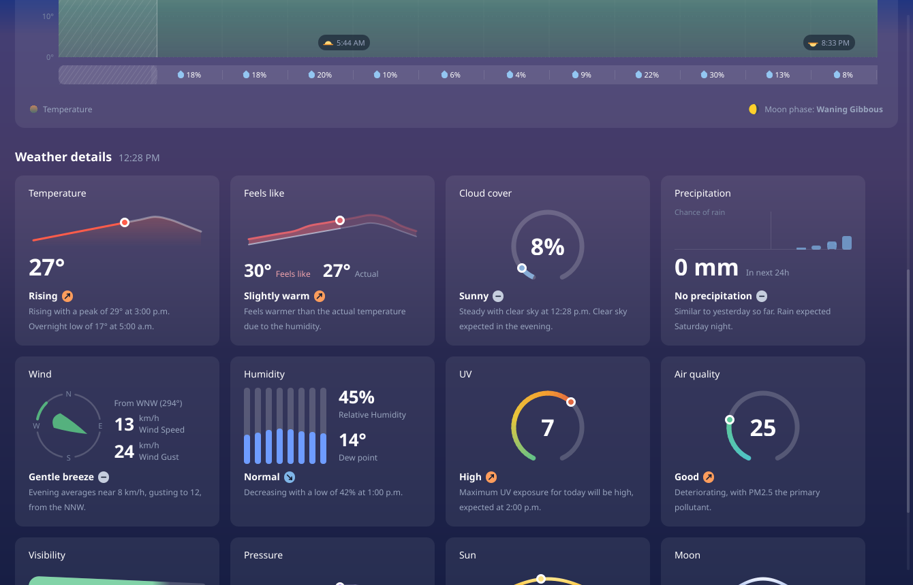
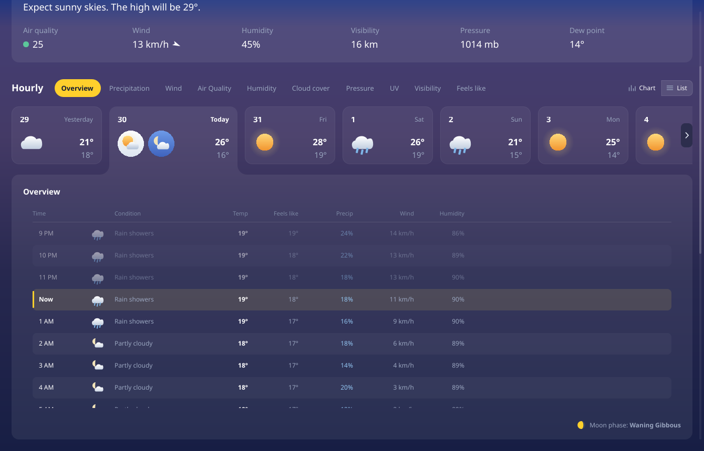

<!-- SPDX-License-Identifier: CC-BY-SA-4.0 -->

# Prototype — Weather page

A Qt Quick rebuild of MSN Weather's forecast page: current conditions, the hourly
section (metric tab bar, day strip, and the chart card that is the most-liked thing
in that app), and the twelve-card weather-details grid — in one scrolling page.


Scroll down for the details grid, twelve cards on one measurable each:



Every metric tab is live, and the chart re-scales, re-colours and changes series type
to match:


The Chart/List switch works too:



## Run it

No build step. It is pure QML, executed by Qt 6's `qml` runtime.

```sh
./run.sh                              # open the page
./run.sh --gallery                    # open the component library
./run.sh --gallery uv                 # …on a particular component
./run.sh --details                    # the weather-details grid on its own
./run.sh --card Uv                    # one detail card, alone on the gradient
./run.sh --grab shot.png              # render one frame headless and exit
./run.sh --grab shot.png --scroll 900 # …scrolled down first
./run.sh --grab shot.png --metric uv  # …with a given tab selected
./run.sh --grab shot.png --list       # …in list view
./run.sh --grab shot.png --day 3      # …with a given day card selected
./run.sh --grab g.png --size 1500x950 # …at a given window size
```

`--scroll` matters more than it sounds. The page is taller than any window it runs
in, so a headless grab without it reviews the top third and silently signs off on
everything below — which is where the twelve charts are.

### Looking at motion

A still frame cannot show motion, and `--grab` lands wherever the animation
happened to be — usually after it finished. **An animation that is missing grabs
identically to one that is right.** `film.sh` films a transition and tiles the
frames into one contact sheet:

```sh
./film.sh out.png -- --size 1000x700 --scroll 430 --poke feels=true
./film.sh out.png --frames 12 --every 45 -- --gallery UV --poke remount=1
./film.sh out.png -- --poke metric=uv
./film.sh out.png -- --poke day=4
```

Frames read left to right, top to bottom. Frame 00 is the state *before* the
poke; everything after it is the transition. If all the frames look identical,
either nothing is animating or the whole thing finished inside one interval —
turn `--every` down before concluding it works.

`--poke` drives `metric`, `day`, `list`, `feels`, `scroll`, and — in the gallery
— `remount`, which rebuilds the specimen so whatever a component does on mount
can be watched twice. That last one exists because the detail cards have no
interaction and no changing data: arrival is the only motion they have.

### The gallery

`--gallery` is the component library: every component in the prototype, each on
the page gradient it is actually composited over, with the states no current
screen happens to use — a toggle switched on, a disabled pager, seven weather
glyphs, a trend badge in all four directions. Arrow keys move; the filter box
matches names and file names; `--gallery <name>` opens straight onto one.

It also has two generated pages. **Colour** reads every token out of `theme.js`
and **Type** reads every size, so a token added there appears in the gallery
without anyone remembering to add it.

Adding a component to it is an entry in `gallery.js` — file, blurb, optionally
a stage size and a list of variants — rather than another QML file. A component
in the tree but not in that list shows up as a gap you can see.

`--walk N` steps N components on before grabbing, so a headless check can
exercise *navigation* rather than only first paint:

```sh
./run.sh --grab g.png --gallery Colour --walk 5
```

That flag exists because every gallery bug found so far only appeared on the
*second* component shown — a specimen drawn on top of its predecessor, a
rebuild firing on a torn-down delegate, a pane still scrolled from the last
entry. Picking one component at startup never touches any of it.

The gallery is worth running after any change to a shared file. Staging
`HourlyOverview` at 1000px wide is what surfaced its hour glyphs escaping the
panel's clip; at the window's own width they escape past the window edge and
nobody ever sees them.

`run.sh` finds a `qml` binary on `PATH`, or falls back to the newest one in the Nix
store, and wires up the environment those builds need. Overrides:

```sh
CLIMA_QML=/path/to/qml ./run.sh     # a specific Qt
QT_QPA_PLATFORM=xcb ./run.sh        # force X11 if Wayland misbehaves
```

Verified on Qt **6.11.1**, offscreen (software) and Wayland (GPU). Requires `QtQuick`
and `QtQuick.Shapes` only — no Qt Charts, no Qt Graphs, no Qt Lottie, so nothing here
pulls in a GPL-only module (see `docs/03-tech-stack.md` §3.1).

## Structure

| File | Role |
|---|---|
| `Main.qml` | Window; hosts the page and routes `--gallery` / `--details` / `--card` / `--film` |
| `film.sh` | **Films a transition and tiles the frames — the way to review motion** |
| `WeatherPage.qml` | **The page — the four sections in one scrolling column** |
| `LocationBar.qml` | Place name, disclosure chevron, home marker |
| `CurrentConditions.qml` | The headline: glyph, temperature, condition, outlook, six slugs |
| `SectionHeader.qml` | A section title and its timestamp, so two sections cannot disagree |
| `Gallery.qml` | The component library browser (`--gallery`) |
| `gallery.js` | **The catalogue it browses — add a component here, not in QML** |
| `Specimen.qml` | Builds one component from a file name and a property bag |
| `WeatherDetails.qml` | The twelve-card weather-details grid |
| `DetailCard.qml` | The shell all twelve detail cards are built in |
| `Detail*Card.qml` | The twelve cards; only the visualisation differs |
| `TrendBadge.qml` | The arrow beside a detail card's status line |
| `detaildata.js` | Current conditions for the detail cards |
| `MetricTabBar.qml` | Section title, metric pills, chart/list switch |
| `DayStrip.qml` | Day cards; the selected one widens and merges into the chart below |
| `HourlyOverview.qml` | The card: title, legend, and the chart/list body |
| `HourlyList.qml` | The list alternative to the chart |
| `DayIconBadge.qml` | Circular day/night icon badge used by the selected day card |
| `TabFillet.qml` | The concave corner where the raised day card meets the panel |
| `SeriesArea.qml` | Gradient-filled curve with an optional dashed overlay line |
| `SeriesBars.qml` | One bar per hour, coloured by its own value |
| `metrics.js` | **The metric registry — the tab bar and the chart are both driven from it** |
| `mockdata.js` | Stand-in for the Open-Meteo provider |
| `theme.js` | Design tokens — colour, geometry, type, and `motion` durations |
| `chartmath.js` | Path generation, ramp sampling, moon phase |
| `WeatherGlyph` · `SunEventGlyph` · `MoonGlyph` · `DropletGlyph` · `HatchPattern` · `PagerButton` · `FeelsLikeToggle` | Small procedural pieces |

## What it does

**The page**

Four sections in one scrolling column — location, current conditions, hourly,
weather details — in the reference's order, which is an argument and not a habit:
what is it doing now, what will it do today, tell me about one thing in particular.

Sections are separated by space and nothing else. No rules, no wrapper panels: every
surface here is a translucent wash, so a panel around a section would make the cards
inside it composite to 0.135 and the whole block would read as a lighter patch. The
page owns the vertical scroll and nothing inside it scrolls vertically, which means
every section has to report an `implicitHeight` rather than fill what it is given —
`HourlyOverview` needed the inverse of its plot-height relation before it could.

Assembling it is what surfaced four defects that were invisible component by
component, including a sun glyph whose "halo" was a flat disc with a traceable edge
and a list view that had the chart painting through it on `main`. See
`docs/10-design-system.md` §10.10.

**Chart**

| | |
|---|---|
| **Metric-driven** | Ten tabs, one implementation. A metric declares its range, colour ramp, unit and whether it draws as an area or as bars; the axis, grid, header band, scrolling, crosshair and past treatment are shared. Adding a metric is a data change in `metrics.js`, not a code change |
| **Area series** | Catmull-Rom spline with control-point clamping, so it is monotone between samples and never invents a dip the data does not contain |
| **Bar series** | For quantities that are sums or banded indices — rain, UV, AQI. Drawing 0.4 mm then 0 mm as a smooth curve would be a lie, and published bands (WHO UV, European AQI) are categorical, so each bar takes the flat colour of its own band |
| **Gradient fill** | Vertical gradient over the *value* axis, so colour encodes the absolute value. Ramps are keyed by normalised axis position rather than by unit, which is what lets one implementation serve °C, %, km/h and hPa |
| **Gradient curve** | `ShapePath` can gradient-*fill* but not gradient-*stroke*, so the line is a thin closed ribbon around the curve, filled with the same ramp |
| **Auto-scaling axis** | Opt-in per metric. Precipitation uses it: a fixed 0–4 mm axis renders a drizzle as a flat line, which reads as "no data" rather than "a little rain" |
| **Overlay series** | Wind draws gusts as a dashed line over the speed area |
| **The past** | Veiled and hatched *over* the series. Observed hours are real data so they stay visible, but they are visibly not forecast |
| **Feels like** | On Overview, toggling *morphs* the curve — the path is regenerated from interpolated points each frame, so it is a genuine tween rather than a crossfade |

**Around it**

- Day cards with per-day icons and highs/lows. The selected card behaves like a browser
  tab: lighter, wider, and *taller* than its neighbours, with its fill running straight
  into the chart card below. That merge is done by **overhang**, not by drawing a join —
  the card extends past the bottom of the strip and the chart card, declared after it,
  paints over the overhang and takes the card's bottom border with it. Nothing has to
  line up to the pixel, and it stays correct at any card position or window size.
  The junction itself is **filleted, not squared**. A tab joined to a panel makes a
  reflex corner — the fill wraps around the *outside* of the angle — so rounding it is
  the inverse of rounding a normal corner: a quarter-disc is subtracted from the gap
  beside the tab, and the fill bulges outward so the tab's side edge flows into the
  panel's top edge. Squaring that corner is what makes a tab look pasted on rather than
  grown out of the surface.
- Selecting a card reveals its night condition beside the daytime one, each in a badge —
  pale for day, blue for night.
- A list view with per-hour rows: condition, temperature, feels-like, precipitation
  probability, wind and humidity. The past is dimmed rather than hidden and "now" is
  marked, so the same rule the chart follows holds there too.
- Metric pills generated from the registry, with a chart/list view switch.
- Horizontal flick + drag and animated pager buttons on both the day strip and the chart,
  disabling at the bounds.
- Hover crosshair with a time/value readout.
- `--grab` renders one frame headless — for design review now, golden-image tests later.

## Data

`mockdata.js` stands in for the Open-Meteo provider, and its shape mirrors what
`libclima`'s forecast provider will return: parallel per-hour arrays plus derived
helpers, with no formatting decisions baked in.

Temperature, precipitation probability and cloud cover are hand-tuned so the labelled
hours match the MSN reference exactly (19, 19, 18, 18, 18, 19, 22, 24, 25, 26, 25, 23 and
18, 18, 20, 10, 6, 4, 9, 22, 30, 13). The other series are *derived* from those rather
than hand-typed, so they stay internally coherent — humidity tracks temperature
inversely, visibility drops in rain, air quality peaks at rush hour and clears in wind.
All of it is deterministic, with no `Math.random`, so golden-image tests stay stable.

## Deliberately not done yet

- **Real data.** No network layer; that is milestone M1.
- **A secondary axis.** Precipitation *probability* belongs on the precipitation tab as a
  percentage line, but that needs a second axis; for now probability lives in the strip
  under the chart, where it shares the same time axis.
- **Selecting a different day** changes the strip but not the chart — there is only one
  day of hourly data behind it.
- **Shipped icons.** Icons are drawn procedurally to keep this a single `qml` invocation.
  Production uses Meteocons (MIT) converted with `svgtoqml`, which ships with
  qtdeclarative and is present in this Qt, so the pipeline is confirmed available.
- **C++ scene-graph rendering.** Paths are generated in JS and handed to `PathSvg`,
  because QML's declarative path elements cannot be produced by a `Repeater`. Decision D3
  in `docs/03-tech-stack.md` moves the curve to a `QQuickItem` writing `QSGGeometryNode`s
  once there is a perf reason; `chartmath.js` is the maths that will port.
- **Accessibility.** No screen-reader data table, no keyboard scrubbing. Both are M2
  requirements and neither is retrofittable for free — do not let this prototype set the
  precedent.

## Notes for whoever picks this up

- `font.pixelSize` is an **int** in Qt. Assigning `12.5` fails object creation, and Qt
  reports it only as `Type X unavailable` from the *parent* file.
- `Item` declares some obvious names — `top` among them — as FINAL. A
  `readonly property real top` in a delegate fails with `Cannot override FINAL property`.
  Prefix delegate locals (`barTop`, `barValue`) to stay clear of them.
- Qt suppresses QML error output entirely when it decides stderr has no console.
  `QT_FORCE_STDERR_LOGGING=1` (which `run.sh` sets) is the difference between a useful
  error and the useless `qml: Did not load any objects, exiting.`
- On a GNOME session Qt loads its **gtk3** platform theme, which initialises the host GTK
  in-process. A Nix-store Qt links its own GTK against a different module path, so
  GNOME's `canberra-gtk-module` cannot be found and GTK prints a warning on every launch.
  `run.sh` sets `QT_QPA_PLATFORMTHEME=generic` **only for Nix-store Qt** — a distro or
  Flatpak Qt has a consistent GTK stack and keeps the integration.
- `Shape.CurveRenderer` gives visibly better antialiasing on the GPU and falls back
  cleanly under the software backend, so it is safe to leave on.
- **Qt Quick Shapes escape ancestor clipping.** `clip: true` on a Flickable or ListView
  does not bound them: condition glyphs from out-of-view list rows drew over the header,
  and a precipitation droplet from an off-screen bucket drew past the card's edge.
  `layer.enabled: true` on an ancestor *does* bound them — but put it on an item with an
  opaque background. On the Flickable itself the layer composited black over the panel;
  on the panel, which has its own fill, it composites correctly.
- **`visible: false` and `opacity: 0` are not the same tool.** The chart has to stay
  in the scene while the list is shown (see the next note), but *loaded* was quietly
  taken to mean *painted*: once cards became translucent washes the chart began
  showing through the list rows, and it shipped that way. `opacity: 0` leaves the
  scene graph exactly as it was and only stops the painting, which is what was
  wanted; `visible: false` is the thing that breaks other nodes. Pair it with
  `enabled: false` or the invisible chart still takes the clicks.
- **Removing the chart subtree from the scene stopped unrelated text from painting.**
  With the chart unloaded, the tab bar's section heading and the "Chart" switch label
  both vanished, while reporting as entirely healthy at runtime — right text, size,
  colour, `visible: true`, `opacity: 1`. So the scene was correct and only the render was
  wrong. Ruled out by bisection: text `renderType`, `Shape.CurveRenderer`, the list's own
  content (an empty list reproduces it), scene-graph layer isolation, grab timing, and
  whole-window versus single-item capture. The chart is therefore kept loaded underneath
  the list rather than unloaded. Worth retrying after the C++ port (decision D3) — this
  looks like a scene-graph bug that a `QSGGeometryNode` implementation may not trip.
