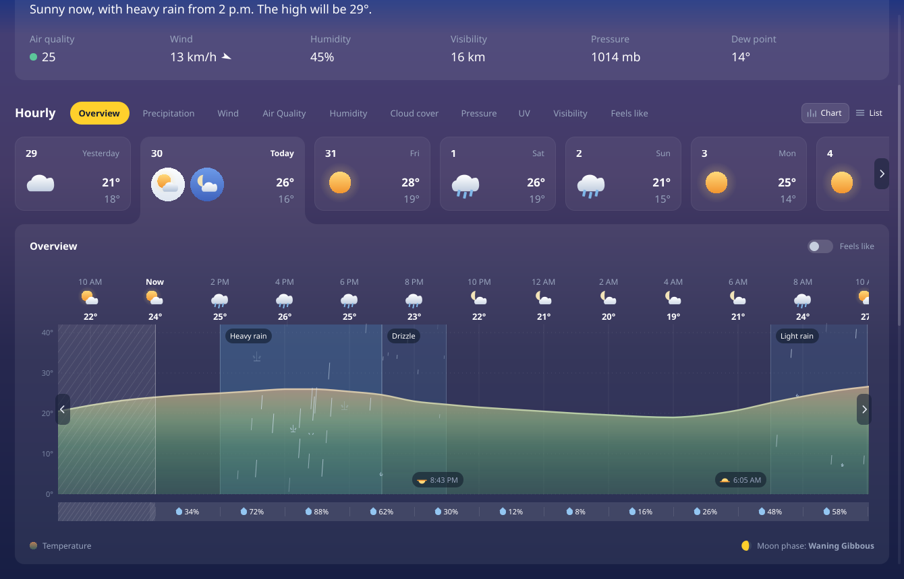
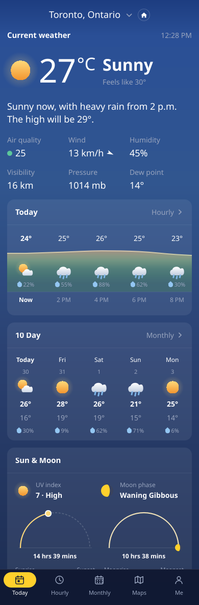
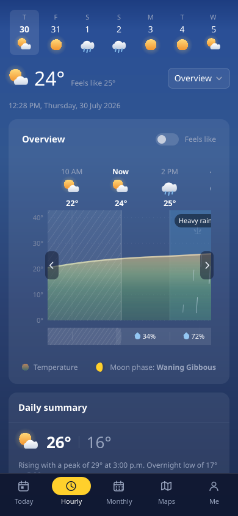
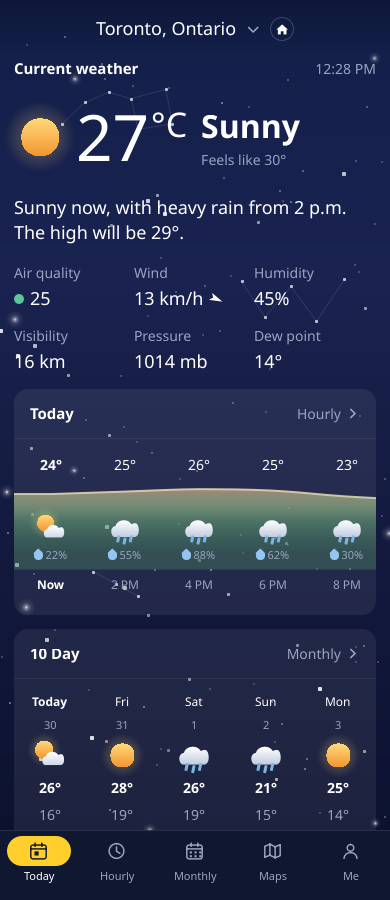
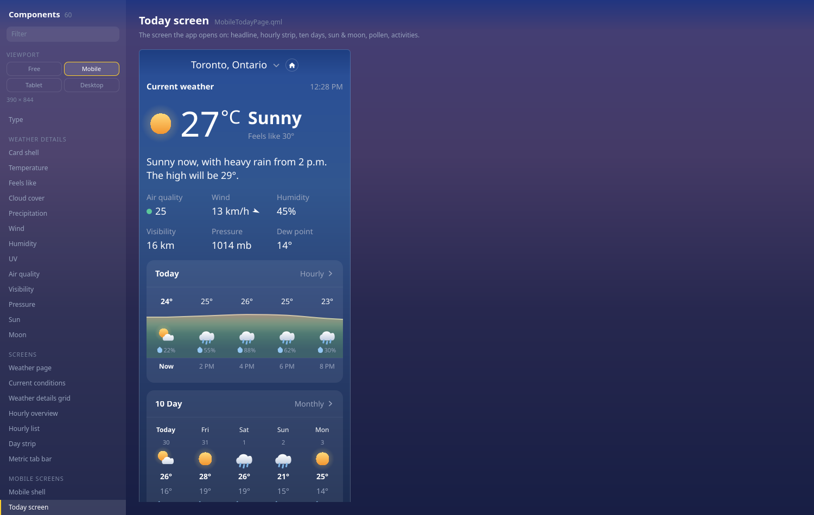

<!-- SPDX-FileCopyrightText: 2026 Jowi Aoun -->
<!-- SPDX-License-Identifier: CC-BY-SA-4.0 -->

# Prototype — Weather page

A Qt Quick rebuild of MSN Weather's forecast page: current conditions, the hourly
section (metric tab bar, day strip, and the chart card that is the most-liked thing
in that app), and the twelve-card weather-details grid — in one scrolling page.


The chart says *when* it will rain, not only how much — the wet hours are washed
and rained on, on every metric tab:



Scroll down for the details grid, twelve cards on one measurable each:


Every metric tab is live, and the chart re-scales, re-colours and changes series type
to match:


The Chart/List switch works too:


## The phone

Narrow the window past 1024 px and the same app runs a different shell: five
destinations under a bottom nav, because the desktop page at 390 px is about
eight screens deep and the fourth of them is unreachable in any sense that
matters.



Today, Hourly, Monthly, Maps and Me. The chart on the Hourly tab is the
desktop's card, not a rewrite of it — the ten metric pills become one button
and a list, which is the only part of it that does not survive the width:



The background follows the clock. Four phases, and a static star field with
three constellations after dark:



There is no map component, so the Maps tab says so in a way a screenshot
cannot hide — see `MapPlaceholder.qml`.

## Run it

No build step. It is pure QML, executed by Qt 6's `qml` runtime.

```sh
./run.sh                              # open the page
./run.sh --viewport mobile            # …as a phone, 390x844
./run.sh --viewport tablet            # …as a tablet, 834x1112
./run.sh --viewport mobile --tab maps # …on a given tab
./run.sh --sky night                  # force the time-of-day background
./run.sh --gallery                    # open the component library
./run.sh --gallery uv                 # …on a particular component
./run.sh --gallery --viewport mobile  # …with every specimen in a phone frame
./run.sh --details                    # the weather-details grid on its own
./run.sh --card Uv                    # one detail card, alone on the gradient
./run.sh --grab shot.png              # render one frame headless and exit
./run.sh --grab shot.png --scroll 900 # …scrolled down first
./run.sh --grab shot.png --metric uv  # …with a given tab selected
./run.sh --grab shot.png --list       # …in list view
./run.sh --grab shot.png --day 3      # …with a given day card selected
./run.sh --grab g.png --size 1500x950 # …at a given window size
```

Which shell runs is a function of the window width and nothing else —
`viewports.js` owns the thresholds, and both the app and the gallery read
them, so the gallery cannot review a width the app never renders. There is no
mobile build and no mobile flag: `--viewport` pins a class and resizes to
match, and `--size 400x800` gets you the phone layout just as well.

`--scroll` matters more than it sounds. The page is taller than any window it runs
in, so a headless grab without it reviews the top third and silently signs off on
everything below — which is where the twelve charts are.

### The images above

Every screenshot in this file is a `--grab`, and this is the command that made
it. They are checked in, so they go stale the moment the data or the layout
moves — regenerate the whole set rather than the one you changed, or the page
ends up illustrated by two different builds:

```sh
./run.sh --grab screenshot.png                 --size 1340x860
./run.sh --grab screenshot-rain.png            --size 1340x860 --scroll 250
./run.sh --grab screenshot-uv.png              --size 1340x860 --scroll 250 --metric uv
./run.sh --grab screenshot-list.png            --size 1340x860 --scroll 250 --list
./run.sh --grab screenshot-details.png         --size 1340x860 --scroll 900
./run.sh --grab screenshot-mobile.png          --viewport mobile --size 390x1180
./run.sh --grab screenshot-mobile-tabs.png     --viewport mobile --tab hourly
./run.sh --grab screenshot-mobile-night.png    --viewport mobile --size 390x900 --sky night
./run.sh --grab screenshot-gallery-viewport.png --gallery Today screen --viewport mobile
```

The two mobile sizes are taller than the 390x844 preset on purpose: a phone
screen's worth of a scrolling page is not what a reader of a README wants to be
shown. `--sky night` forces the backdrop and not the data, which is the only way
to photograph the star field — the mock cannot be a different time of day.

Run any of them twice and `cmp` the results. They are byte-identical, and if one
is not, something in the prototype has started reading a clock or a random
number generator and the golden images are worth nothing.

### Looking at motion

A still frame cannot show motion, and `--grab` lands wherever the animation
happened to be — usually after it finished. **An animation that is missing grabs
identically to one that is right.** `film.sh` films a transition and tiles the
frames into one contact sheet:

```sh
./film.sh out.png -- --size 1000x700 --scroll 430 --poke feels=true
./film.sh out.png --frames 12 --every 45 -- --gallery UV --poke remount=1
./film.sh out.png -- --poke metric=uv
./film.sh out.png -- --poke day=4
```

Frames read left to right, top to bottom. Frame 00 is the state *before* the
poke; everything after it is the transition. If all the frames look identical,
either nothing is animating or the whole thing finished inside one interval —
turn `--every` down before concluding it works.

`--poke` drives `metric`, `day`, `list`, `feels`, `scroll`, and — in the gallery
— `remount`, which rebuilds the specimen so whatever a component does on mount
can be watched twice. That last one exists because the detail cards have no
interaction and no changing data: arrival is the only motion they have.

### The gallery

`--gallery` is the component library: every component in the prototype, each on
the page gradient it is actually composited over, with the states no current
screen happens to use — a toggle switched on, a disabled pager, seven weather
glyphs, a trend badge in all four directions. Arrow keys move; the filter box
matches names and file names; `--gallery <name>` opens straight onto one.

It also has two generated pages. **Colour** reads every token out of `theme.js`
and **Type** reads every size, so a token added there appears in the gallery
without anyone remembering to add it.

Adding a component to it is an entry in `gallery.js` — file, blurb, optionally
a stage size and a list of variants — rather than another QML file. A component
in the tree but not in that list shows up as a gap you can see.

### Viewports

The rail has a viewport control: **Free**, **Mobile**, **Tablet**, **Desktop**
(left and right arrow keys step through them, `--viewport <id>` alongside
`--gallery` picks one on the command line). Anything but Free stages the
specimen inside a device-sized box with the page gradient — and, on a phone
frame, the sky — painted *inside* it:



The width is the point. Almost every layout defect found in this prototype so
far was a component that was fine at the width its author happened to try and
wrong at the width the app gives it; the hour glyphs escaping the panel's clip
were found exactly that way, by staging `HourlyOverview` at 1000 px. A frame
makes that width something you choose rather than something you inherit from
whatever size the gallery window happens to be.

What a specimen is given inside a frame depends on what the catalogue declares:

| Entry declares | In a frame it gets |
|---|---|
| `fills: true` | the whole device — screens and shells |
| `stage: { w, … }` | the width that viewport's shell would hand it, not the catalogue's number |
| neither | its natural size, centred, inset by the page margin |

A stage width was only ever a stand-in for a host that was not there, so when a
frame *is* there the frame wins. Frames are not scaled to fit: a desktop frame
overflows the pane and the pane scrolls, because a half-size preview of an
11 px axis label tells you nothing about whether it is legible.

`--walk N` steps N components on before grabbing, so a headless check can
exercise *navigation* rather than only first paint:

```sh
./run.sh --grab g.png --gallery Colour --walk 5
```

That flag exists because every gallery bug found so far only appeared on the
*second* component shown — a specimen drawn on top of its predecessor, a
rebuild firing on a torn-down delegate, a pane still scrolled from the last
entry. Picking one component at startup never touches any of it.

The gallery is worth running after any change to a shared file. Staging
`HourlyOverview` at 1000px wide is what surfaced its hour glyphs escaping the
panel's clip; at the window's own width they escape past the window edge and
nobody ever sees them.

`run.sh` finds a `qml` binary on `PATH`, or falls back to the newest one in the Nix
store, and wires up the environment those builds need. Overrides:

```sh
CLIMA_QML=/path/to/qml ./run.sh     # a specific Qt
QT_QPA_PLATFORM=xcb ./run.sh        # force X11 if Wayland misbehaves
```

Verified on Qt **6.11.1**, offscreen (software) and Wayland (GPU). Requires `QtQuick`
and `QtQuick.Shapes` only — no Qt Charts, no Qt Graphs, no Qt Lottie, so nothing here
pulls in a GPL-only module (see `docs/03-tech-stack.md` §3.1).

## Structure

| File | Role |
|---|---|
| `Main.qml` | Window; picks a shell by width and routes `--gallery` / `--details` / `--card` / `--film` |
| `viewports.js` | **Viewport classes and the widths that separate them — the app and the gallery both read it** |
| `PageBackdrop.qml` | The gradient every surface is composited over, plus the star field |
| `sky.js` | Which phase of the day it is, and where the stars and constellations go |
| `film.sh` | **Films a transition and tiles the frames — the way to review motion** |
| `WeatherPage.qml` | **The desktop page — the four sections in one scrolling column** |
| `LocationBar.qml` | Place name, disclosure chevron, home marker |
| `CurrentConditions.qml` | The headline: glyph, temperature, condition, outlook, six slugs |
| `SectionHeader.qml` | A section title and its timestamp, so two sections cannot disagree |
| `Gallery.qml` | The component library browser (`--gallery`) |
| `gallery.js` | **The catalogue it browses — add a component here, not in QML** |
| `Specimen.qml` | Builds one component from a file name and a property bag |
| `WeatherDetails.qml` | The twelve-card weather-details grid |
| `DetailCard.qml` | The shell all twelve detail cards are built in |
| `Detail*Card.qml` | The twelve cards; only the visualisation differs |
| `TrendBadge.qml` | The arrow beside a detail card's status line |
| `detaildata.js` | Current conditions for the detail cards |
| `MetricTabBar.qml` | Section title, metric pills, chart/list switch |
| `DayStrip.qml` | Day cards; the selected one widens and merges into the chart below |
| `HourlyOverview.qml` | The card: title, legend, and the chart/list body |
| `HourlyList.qml` | The list alternative to the chart |
| `DayIconBadge.qml` | Circular day/night icon badge used by the selected day card |
| `TabFillet.qml` | The concave corner where the raised day card meets the panel |
| `SeriesArea.qml` | Gradient-filled curve with an optional dashed overlay line |
| `SeriesBars.qml` | One bar per hour, coloured by its own value |
| `PrecipBands.qml` | **The wash that says when it rains** — under the series |
| `PrecipField.qml` | Rain, snow, sleet, hail falling over it, and the spell's name |
| `precip.js` | **Thresholds, spells and the deterministic particle field** |
| `metrics.js` | **The metric registry — the tab bar and the chart are both driven from it** |
| `mockdata.js` | Stand-in for the Open-Meteo provider |
| `theme.js` | Design tokens — colour, geometry, type, and `motion` durations |
| `chartmath.js` | Path generation, ramp sampling, moon phase |
| `WeatherGlyph` · `SunEventGlyph` · `MoonGlyph` · `DropletGlyph` · `HatchPattern` · `PagerButton` · `FeelsLikeToggle` · `ChevronGlyph` · `NavGlyph` | Small procedural pieces |

The phone shell:

| File | Role |
|---|---|
| `MobileShell.qml` | **The five destinations under a bottom nav; owns the state a page outlives** |
| `mobiletabs.js` | The list of destinations — add a screen here, not in QML |
| `BottomNav.qml` | The nav bar. The pill slides; the page behind it does not transition |
| `MobilePage.qml` | The scrolling container all five screens are built in |
| `MobileCard.qml` | The card shell they are filled with — grows to its body, unlike `DetailCard` |
| `MobileTodayPage.qml` | Headline, hourly strip, ten days, sun & moon, pollen, activities |
| `MobileHourlyPage.qml` | Week strip, reading, metric picker, the desktop's chart, daily summary |
| `MobileMonthlyPage.qml` · `MobileCalendar.qml` | A month of forecasts, four days to a row |
| `MobileMapsPage.qml` · `MapPlaceholder.qml` | **There is no map. This says so** |
| `MobileMePage.qml` | Units, places, attribution — the one screen that is a proposal |
| `MobileCurrentWeather.qml` | The headline, on the sky rather than on a card |
| `MobileHourStrip.qml` · `MobileDailyStrip.qml` | The two horizontal strips on Today |
| `MobileSunMoonCard.qml` · `SkyArc.qml` | Rise-to-set progress, twice, on one reveal |
| `MobilePollenCard.qml` · `MobileActivitiesCard.qml` | A band and three rings; five verdicts |
| `MobileWeekStrip.qml` · `MobileMetricPicker.qml` | The Hourly tab's two controls |

## What it does

**Two shells, one product**

There is no mobile build. `viewports.js` says a window under 600 px is a
phone, under 1024 a tablet, and anything wider a desktop; `Main.qml` loads
`WeatherPage` or `MobileShell` accordingly and nothing else in the app knows
which is running. Tablet deliberately runs the phone's shell with the content
column capped rather than stretched — it is not a third layout and should not
become one without a reason.

What the phone changes, and why each one is a consequence of the width rather
than a restyling:

| | |
|---|---|
| **The page splits** | Four sections become five tabs. The desktop column at 390 px is eight screens deep, and scrolling is not navigation |
| **The hero loses its card** | It sits on the sky. On the desktop a wash separates it from the three sections around it; here there is nothing above it to be separated from |
| **Ten pills become a button** | A scrolling row of controls directly above a scrolling chart is two things that move sideways under the same thumb |
| **The chart keeps everything else** | Same `HourlyOverview`, at 40 px columns and a 180 px plot. Both are now properties on it |
| **Six slugs wrap 3 × 2** | Six across needs about 790 px |
| **The calendar is four columns, not seven** | A forecast is scanned for warm stretches, not looked up by weekday. Seven columns on a phone is 52 px a day, which fits a date and nothing else |
| **The background follows the clock** | Four phases and a star field. The desktop stays at `dusk` — its background is a rim around cards nobody looks at |

Every sky phase is dark, and that is a constraint rather than a preference:
surfaces here are white washes at 0.05–0.10, and a wash is only a surface if
something darker is behind it. A literal daylight sky would make every card on
every screen invisible at once. The phases differ in hue and clarity.

Nothing in the sky animates. §10.6 forbids anything that moves on a timer, and
a twinkling star field breaks that rule harder than anything else here: it
would run forever, behind every screen, while the reader is trying to read a
number off a chart — and it would make every golden image of every mobile
screen a coin toss. `sky.js` has no `Math.random` in it for the same reason.

**The page**

Four sections in one scrolling column — location, current conditions, hourly,
weather details — in the reference's order, which is an argument and not a habit:
what is it doing now, what will it do today, tell me about one thing in particular.

Sections are separated by space and nothing else. No rules, no wrapper panels: every
surface here is a translucent wash, so a panel around a section would make the cards
inside it composite to 0.135 and the whole block would read as a lighter patch. The
page owns the vertical scroll and nothing inside it scrolls vertically, which means
every section has to report an `implicitHeight` rather than fill what it is given —
`HourlyOverview` needed the inverse of its plot-height relation before it could.

Assembling it is what surfaced four defects that were invisible component by
component, including a sun glyph whose "halo" was a flat disc with a traceable edge
and a list view that had the chart painting through it on `main`. See
`docs/10-design-system.md` §10.10.

**Chart**

| | |
|---|---|
| **Metric-driven** | Ten tabs, one implementation. A metric declares its range, colour ramp, unit and whether it draws as an area or as bars; the axis, grid, header band, scrolling, crosshair and past treatment are shared. Adding a metric is a data change in `metrics.js`, not a code change |
| **Area series** | Catmull-Rom spline with control-point clamping, so it is monotone between samples and never invents a dip the data does not contain |
| **Bar series** | For quantities that are sums or banded indices — rain, UV, AQI. Drawing 0.4 mm then 0 mm as a smooth curve would be a lie, and published bands (WHO UV, European AQI) are categorical, so each bar takes the flat colour of its own band |
| **Gradient fill** | Vertical gradient over the *value* axis, so colour encodes the absolute value. Ramps are keyed by normalised axis position rather than by unit, which is what lets one implementation serve °C, %, km/h and hPa |
| **Gradient curve** | `ShapePath` can gradient-*fill* but not gradient-*stroke*, so the line is a thin closed ribbon around the curve, filled with the same ramp |
| **Auto-scaling axis** | Opt-in per metric. Precipitation uses it: a fixed 0–4 mm axis renders a drizzle as a flat line, which reads as "no data" rather than "a little rain" |
| **Overlay series** | Wind draws gusts as a dashed line over the speed area |
| **The past** | Veiled and hatched *over* the series. Observed hours are real data so they stay visible, but they are visibly not forecast. The chart opens on "now" with one label interval of them still to its left — a section called *Hourly* that opens on last night is not showing the hours anyone came for, and one that opens exactly on the now line never shows the past treatment at all |
| **Feels like** | On Overview, toggling *morphs* the curve — the path is regenerated from interpolated points each frame, so it is a genuine tween rather than a crossfade |
| **Precipitation** | The one variable people ask *when* about rather than *how much*, so it gets a second encoding on every tab: the wet hours are washed, rained on and named. See below |

**Precipitation**

Three layers, each carrying a different part of the reading. A **wash** under the
series, edge to edge of the spell, says *when*. A **field** of falling particles
over it says *what* and *how hard*. A **caption** on any spell wide enough to
hold one says it in words.

The wash goes under the series and the field over it, which is why they are two
components. A fill's colour on this chart is its value, and on UV and air quality
those colours are a published scale — a blue wash laid over a UV bar would be
stating a different number. Underneath it still reads, because every fill here is
translucent, and the reference turns out to do exactly the same thing: measured
off a capture, its rainy stretch shifts the empty plot about three times as much
as it shifts the area fill.

Ten levels come off one particle model rather than ten drawings:

| | |
|---|---|
| **Type picks the shape** | rain and drizzle fall as streaks, snow drifts as flakes with a sway, hail comes down as fast pellets, sleet is a mix of streaks and pellets because drawn as short rain it just reads as rain in a hurry, thunderstorms are heavy rain plus a band that flashes |
| **Intensity scales it** | light / moderate / heavy is the same field with twice the drops, longer and faster — which is what heavier weather looks like out of a window |
| **Thresholds are published ones** | US NWS bands for rain; a third of them for snow, because the same water arrives as ten times the depth |
| **Spells split on type, not intensity** | rain easing off is still the same rain. The spell is labelled by its peak: "heavy rain, 2 to 6" is what you would say out loud about a spell with one heavy hour in it |
| **Both edges are drawn** | a wash says roughly when; a line on its first and last minute says exactly when |
| **Deterministic** | every drop is a hash of its hour and its index in that hour — no `Math.random`, so `--grab` is still a golden image. Two consecutive grabs are byte-identical |

Motion is one clock for the whole field, and it does not run when there is no
precipitation, when the chart is behind the list view, or under `--grab` — which
freezes the field at a deterministic frame rather than emptying it. The cost is
proportional to the weather rather than to the chart: the mock's four spells come
to 54 drops and 20 splashes across 48 hours, and a dry forecast draws nothing.

At 18–28 °C the page can only ever show rain, so the six levels anyone would name
first — and the four extras — live in the gallery, under *Precipitation wash* and
*Precipitation field*.

**Around it**

- Day cards with per-day icons and highs/lows. The selected card behaves like a browser
  tab: lighter, wider, and *taller* than its neighbours, with its fill running straight
  into the chart card below. That merge is done by **overhang**, not by drawing a join —
  the card extends past the bottom of the strip and the chart card, declared after it,
  paints over the overhang and takes the card's bottom border with it. Nothing has to
  line up to the pixel, and it stays correct at any card position or window size.
  The junction itself is **filleted, not squared**. A tab joined to a panel makes a
  reflex corner — the fill wraps around the *outside* of the angle — so rounding it is
  the inverse of rounding a normal corner: a quarter-disc is subtracted from the gap
  beside the tab, and the fill bulges outward so the tab's side edge flows into the
  panel's top edge. Squaring that corner is what makes a tab look pasted on rather than
  grown out of the surface.
- Selecting a card reveals its night condition beside the daytime one, each in a badge —
  pale for day, blue for night.
- A list view with per-hour rows: condition, temperature, feels-like, precipitation
  probability, wind and humidity. The past is dimmed rather than hidden and "now" is
  marked, so the same rule the chart follows holds there too.
- Metric pills generated from the registry, with a chart/list view switch.
- Horizontal flick + drag and animated pager buttons on both the day strip and the chart,
  disabling at the bounds.
- Hover crosshair with a time/value readout.
- `--grab` renders one frame headless — for design review now, golden-image tests later.

## Data

`mockdata.js` stands in for the Open-Meteo provider, and its shape mirrors what
`libclima`'s forecast provider will return: parallel per-hour arrays plus derived
helpers, with no formatting decisions baked in.

Temperature is hand-tuned so the labelled hours match the MSN reference exactly
(19, 19, 18, 18, 18, 19, 22, 24, 25, 26, 25, 23). The other series are *derived* from
temperature, cloud and the hour rather than hand-typed, so they stay internally
coherent — humidity tracks temperature inversely, visibility drops in rain, air
quality peaks at rush hour and clears in wind. All of it is deterministic, with no
`Math.random`, so golden-image tests stay stable.

**Precipitation probability and cloud cover diverge from the reference at the wet
hours, deliberately.** The reference's forecast is dry, so a mock copied from it can
only demonstrate a precipitation effect by not having any — and once the mock has
weather, the numbers around it have to agree with it. A 4 % chance of 8.6 mm, or heavy
rain out of a half-clear sky, is the more embarrassing thing to ship than a divergence
from a screenshot. Away from those hours both series are still the reference's.

The forecast is four spells: last night's rain, over by 01:00 and behind the now line
by the time the page opens, an afternoon band that climbs light → moderate → heavy and
back, its tail, and a light band after tomorrow's sunrise. `detaildata.js` moved with
it — the precipitation card reads 21 mm and "heavy rain expected" rather than nought,
and the headline's outlook sentence says so too.

**Both mock files describe one instant.** `mockdata.js` puts "Now" at index 15, which
is 12:00, and `detaildata.js` observes at 12:28 PM on Thursday 30 July 2026; both take
the same sunrise (6:04 AM) and the same sunset (8:43 PM), so `mockdata.isNight()` and
the sky behind the hero cannot disagree. That agreement is not a coincidence anyone has
to maintain by hand — `detaildata.js`'s twelve-hour context window *is*
`mockdata.precipProb[9..20]`, and its own `nowIndex` of 6 lands on index 15. The two
files were always written against the same series; only the now marker was in the wrong
place, and for a while it put moon glyphs under a hero drawing a sun.

Fifteen of the forty-eight hours have therefore already happened when the page opens,
which is the shape a provider hands over at midday rather than an artefact of the mock:
Open-Meteo's hourly forecast starts at 00:00 today. The chart opens on "now" with the
last label interval of observed hours still to its left, for exactly that reason.

## Deliberately not done yet

- **Real data.** No network layer; that is milestone M1.
- **A map.** The Maps tab is a placeholder and is drawn to be unmistakable
  about it — hatched, dash-outlined and labelled in words. A tasteful empty
  state in the house colours is exactly what a *finished* screen with no data
  looks like, and six weeks later somebody files a bug about the map not
  loading. Real one is MapLibre Native, decision D4.
- **The hero's numbers and the chart's come from two different panels of the
  reference.** The two mock files now agree about *when* — one instant, one
  sunrise, one sunset — and they still differ about *how warm*: at that hour
  the chart reads 24° and today's high as 26°, while the hero reads 27° and
  29°. Each is the reference's own number for the panel it was traced from, so
  reconciling them means re-tuning one against the other rather than against
  the capture, and the capture is the only thing here that can settle an
  argument. Worth doing when a provider replaces both, which is when the
  numbers stop being traced at all.
- **A month picker** on the Monthly tab. There is one month of data behind it,
  so a picker would open a list with one thing in it.
- **A tablet layout.** Tablet runs the phone's shell with the content column
  capped at 620 px. That is a deliberate first pass, not a finished answer — a
  834 px screen could carry two columns of cards, and `viewports.js`'s
  `usesMobileShell()` is the one place that would have to change.
- **A secondary axis.** Precipitation *probability* belongs on the precipitation tab as a
  percentage line, but that needs a second axis; for now probability lives in the strip
  under the chart, where it shares the same time axis.
- **Selecting a different day** changes the strip but not the chart — there is only one
  day of hourly data behind it.
- **A weather code from the provider.** Precipitation type is inferred from temperature
  here, which is a fair fallback and cannot ever produce thunder or hail — those two
  exist in `precip.js` and in the gallery but never on the page. Open-Meteo sends a WMO
  code per hour; `Precip.cells` already takes one as its third argument.
- **Shipped icons.** Icons are drawn procedurally to keep this a single `qml` invocation.
  Production uses Meteocons (MIT) converted with `svgtoqml`, which ships with
  qtdeclarative and is present in this Qt, so the pipeline is confirmed available.
- **C++ scene-graph rendering.** Paths are generated in JS and handed to `PathSvg`,
  because QML's declarative path elements cannot be produced by a `Repeater`. Decision D3
  in `docs/03-tech-stack.md` moves the curve to a `QQuickItem` writing `QSGGeometryNode`s
  once there is a perf reason; `chartmath.js` is the maths that will port.
- **Accessibility.** No screen-reader data table, no keyboard scrubbing. Both are M2
  requirements and neither is retrofittable for free — do not let this prototype set the
  precedent.

## Notes for whoever picks this up

- `font.pixelSize` is an **int** in Qt. Assigning `12.5` fails object creation, and Qt
  reports it only as `Type X unavailable` from the *parent* file.
- `Item` declares some obvious names — `top` among them — as FINAL. A
  `readonly property real top` in a delegate fails with `Cannot override FINAL property`.
  Prefix delegate locals (`barTop`, `barValue`) to stay clear of them.
- **`palette` is one of those names, and it does not fail — it warns.**
  `property var palette` on an Item-derived type builds fine and prints
  `Member palette … overrides a member of the base object` at runtime, leaving
  a property that quietly means two things. `PageBackdrop` calls its
  `skyPalette`.
- **`parent` inside a `RadialGradient` is the `ShapePath`, not the item.** So
  `centerRadius: parent.width / 2` is `NaN`, and a NaN radius renders as a flat
  disc of the first stop's colour rather than as nothing — nine hard white
  blobs sitting on top of a card, from code that reads correctly. Reference an
  `id` from the item you actually mean. The same applies to `centerX`/`centerY`.
- **A `Column` skips a child with `visible: false`.** It does not leave a gap.
  Hiding the date under "Today" in the ten-day strip therefore pulled that
  column's icon, high and low 20 px above the nine beside them. If a row has to
  align across cells, every cell needs the same children — give the odd one out
  an empty string, not `visible: false`.
- Qt suppresses QML error output entirely when it decides stderr has no console.
  `QT_FORCE_STDERR_LOGGING=1` (which `run.sh` sets) is the difference between a useful
  error and the useless `qml: Did not load any objects, exiting.`
- On a GNOME session Qt loads its **gtk3** platform theme, which initialises the host GTK
  in-process. A Nix-store Qt links its own GTK against a different module path, so
  GNOME's `canberra-gtk-module` cannot be found and GTK prints a warning on every launch.
  `run.sh` sets `QT_QPA_PLATFORMTHEME=generic` **only for Nix-store Qt** — a distro or
  Flatpak Qt has a consistent GTK stack and keeps the integration.
- `Shape.CurveRenderer` gives visibly better antialiasing on the GPU and falls back
  cleanly under the software backend, so it is safe to leave on.
- **Qt only antialiases a rounded `Rectangle` when asked.** At the two or three pixels
  a snowflake is drawn at, `radius: width / 2` without `antialiasing: true` is a
  square — and it is a square at every size, just less obviously.
- **Qt Quick Shapes escape ancestor clipping.** `clip: true` on a Flickable or ListView
  does not bound them: condition glyphs from out-of-view list rows drew over the header,
  and a precipitation droplet from an off-screen bucket drew past the card's edge.
  `layer.enabled: true` on an ancestor *does* bound them — but put it on an item with an
  opaque background. On the Flickable itself the layer composited black over the panel;
  on the panel, which has its own fill, it composites correctly.
- **`visible: false` and `opacity: 0` are not the same tool.** The chart has to stay
  in the scene while the list is shown (see the next note), but *loaded* was quietly
  taken to mean *painted*: once cards became translucent washes the chart began
  showing through the list rows, and it shipped that way. `opacity: 0` leaves the
  scene graph exactly as it was and only stops the painting, which is what was
  wanted; `visible: false` is the thing that breaks other nodes. Pair it with
  `enabled: false` or the invisible chart still takes the clicks.
- **Removing the chart subtree from the scene stopped unrelated text from painting.**
  With the chart unloaded, the tab bar's section heading and the "Chart" switch label
  both vanished, while reporting as entirely healthy at runtime — right text, size,
  colour, `visible: true`, `opacity: 1`. So the scene was correct and only the render was
  wrong. Ruled out by bisection: text `renderType`, `Shape.CurveRenderer`, the list's own
  content (an empty list reproduces it), scene-graph layer isolation, grab timing, and
  whole-window versus single-item capture. The chart is therefore kept loaded underneath
  the list rather than unloaded. Worth retrying after the C++ port (decision D3) — this
  looks like a scene-graph bug that a `QSGGeometryNode` implementation may not trip.
